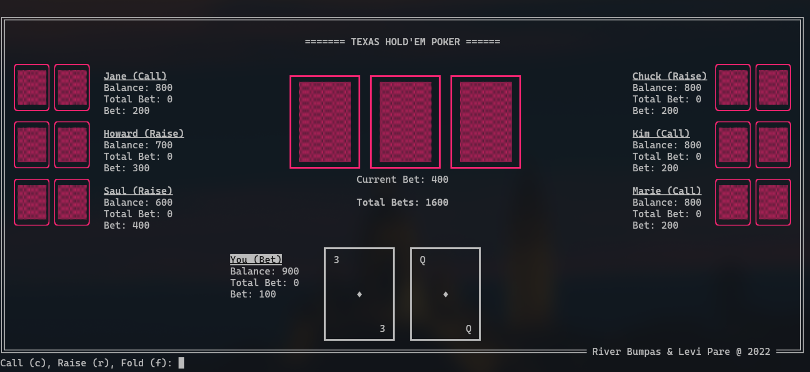

## Levi Pare and River Bumpas - 2022 CS21

### Description:

This is a texas hold'em poker game written in python. You play against bots and are able to control betting actions.

### Instructions:

Run main.py (preferably in a standalone terminal) to play. The terminal must have a width of at least 140 characters to ensure proper displaying of the game.

### Citations:

ANSI Escape sequences were found here:
https://gist.github.com/fnky/458719343aabd01cfb17a3a4f7296797
